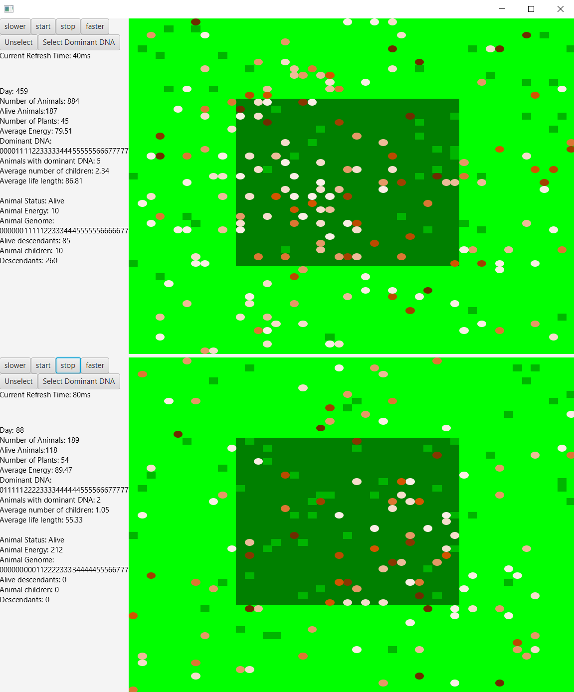

# Evolution Simulator
The application simulates the environment presented below:
* The animals are marked as circles, having different colors depending on how much energy they have. The more energy they have, the darker they become.
* To gain energy they need to eat grass which is marked as green rectangles. Each day one grass spawns randomly in the jungle(dark green area), and outside of it. Each animal moves exactly once a day in a direction chosen randomly from the genome.
* If two animals meet each other and have enough energy, they reproduce, creating a new animal with a genome that is a mix of its parents’ genome.
* On the left side of the window is an available statistics tracker, which enables to track base population data, such as average energy and number of alive animals
* It is also possible to track one animal by clicking on it. Then more detailed data will be presented, such as the selected animal’s genome and the number of its descendants.
* It is possible to run two simulations that run separately at once.

To run the program you first need to build gradle and then run gradle.
The initial variables such as grass energy value and number of animals are can be modified in src/main/resources/source.json
